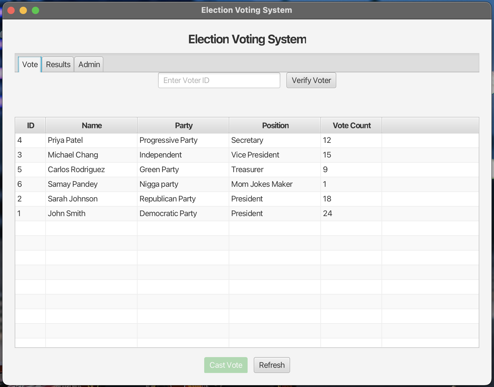
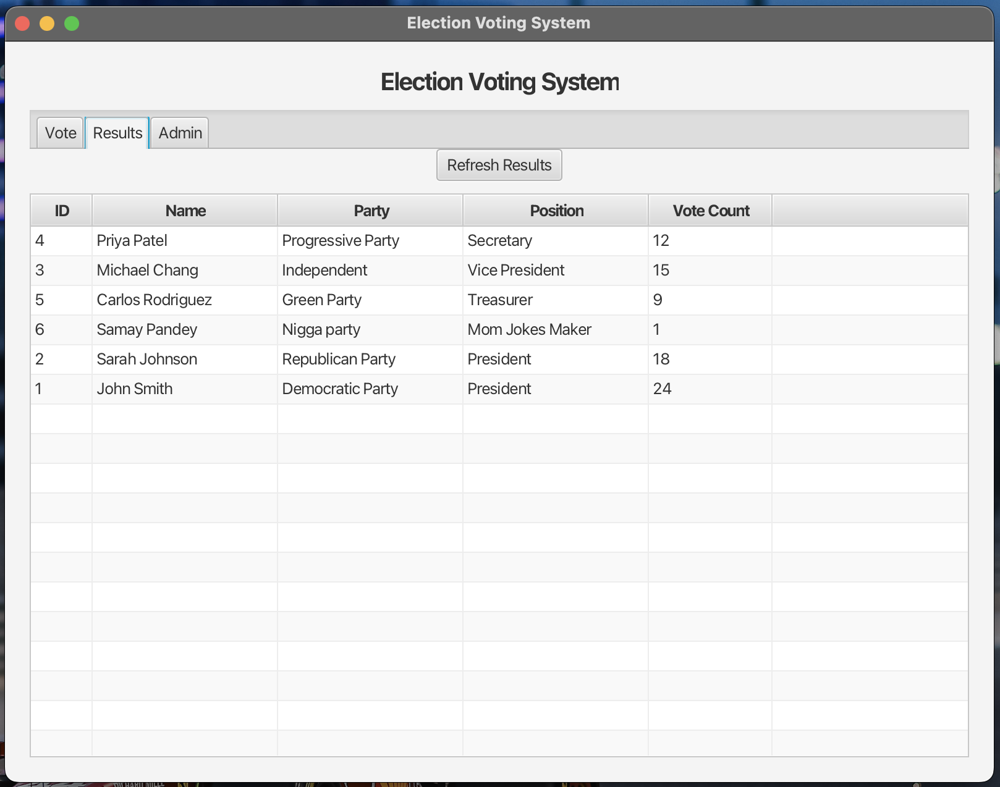
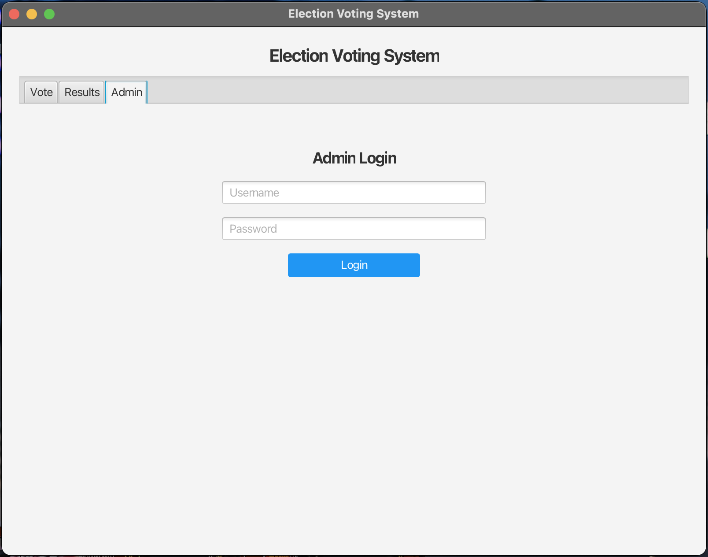
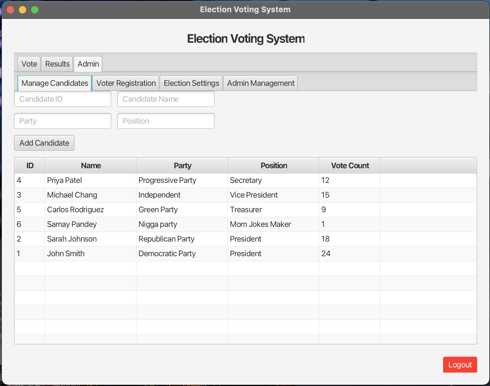
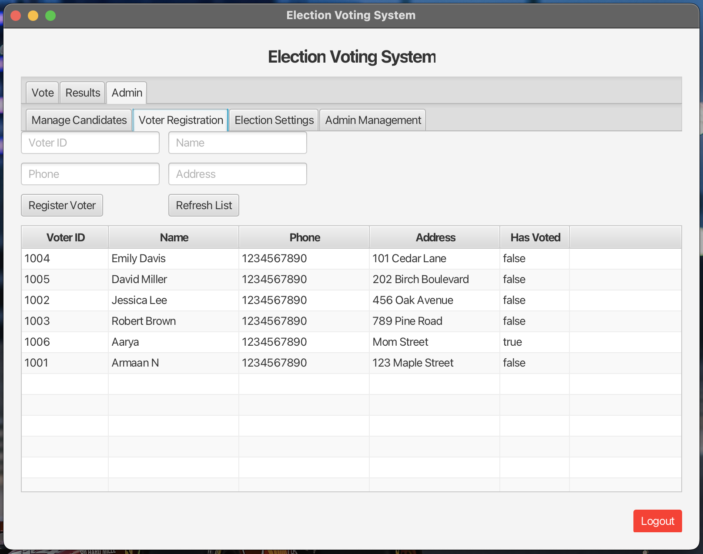
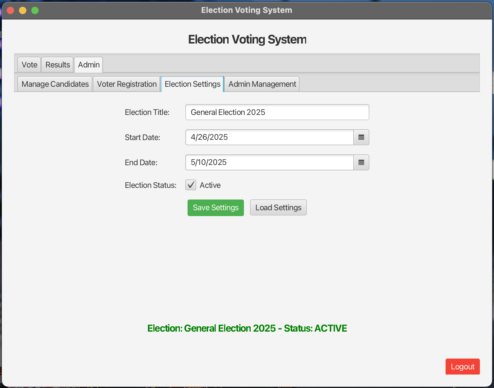
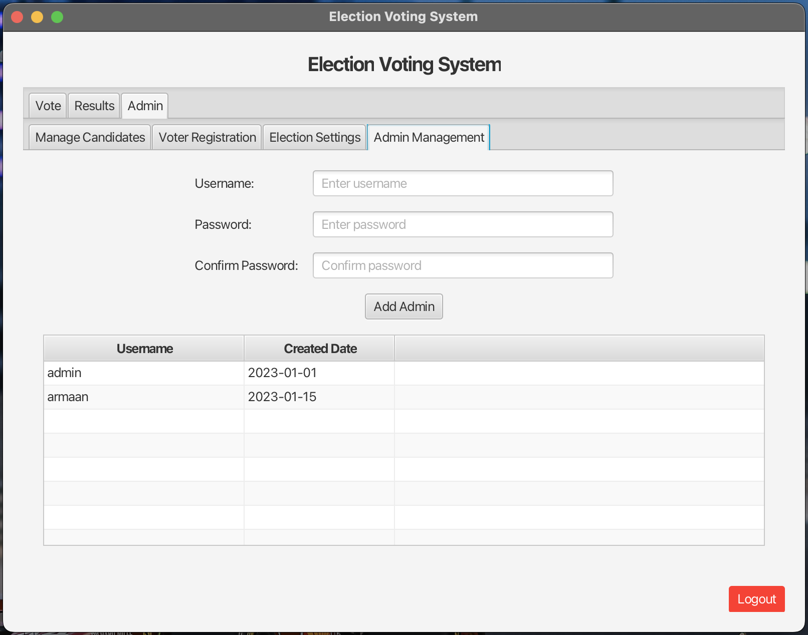

# Election Voting System

A Java FX application for managing elections, allowing voters to cast votes and administrators to manage candidates, voters, and election settings.

## Table of Contents

- [Features](#features)
- [Screenshots](#screenshots)
- [Technologies Used](#technologies-used)
- [Prerequisites](#prerequisites)
- [Getting Started](#getting-started)
  - [Building the Project](#building-the-project)
  - [Setting up Firebase](#setting-up-firebase)
  - [Creating the Configuration File](#creating-the-configuration-file)
- [Running the Application](#running-the-application)
- [Usage Guide](#usage-guide)
  - [Voter Functions](#voter-functions)
  - [Admin Functions](#admin-functions)
- [Project Structure](#project-structure)


## Features

- **Voter Verification**: Validates voter IDs before allowing votes to be cast
- **Candidate Management**: Add and view candidates with party affiliations
- **Voter Registration**: Register new voters with personal details
- **Election Configuration**: Set election dates and activation status
- **Admin Authentication**: Secure login for administrative functions
- **Real-time Results**: View updated vote counts as they are cast
- **Firebase Integration**: Store all data in a Firebase Realtime Database

## Screenshots

| | |
|:-------------------------:|:-------------------------:|
|  |  |
| *Voter verification and ballot casting interface* | *Real-time election results and statistics* |
|  |  |
| *Secure authentication portal for administrators* | *Add, edit and manage election candidates* |
|  |  |
| *Register new voters and update voter information* | *Configure election parameters and activation status* |
|  | |
| *Manage administrator accounts and privileges* | |

## Technologies Used

- Java 21
- JavaFX 21
- Maven
- Firebase Realtime Database
- JSON for data storage

## Prerequisites

- Java JDK 21 or higher
- Maven 3.6.0 or higher
- Internet connection for Firebase connectivity

## Getting Started

### Building the Project

1. Clone this repository:
```bash
git clone [repository-url]
cd voting-system
```

2. Install dependencies and build using Maven:
```bash
mvn clean install
```


### Setting up Firebase

1. **Create a Firebase Project**:
   - Go to [Firebase Console](https://console.firebase.google.com/)
   - Click on "Add project" and follow the instructions
   - Create a Realtime Database (not Firestore)
   - Set the database rules to allow read/write access

2. **Import Database Rules**:
   - Navigate to your Firebase project's Realtime Database
   - Click on the "Rules" tab
   - Copy the contents of `/backup/firebase-rules.json` from this project
   - Paste the rules into the Firebase console and publish them

3. **Import Initial Data (Optional)**:
   - Navigate to your Firebase project's Realtime Database
   - Click on the three dots menu and select "Import JSON"
   - Upload the `/backup/firebase-data.json` file from this project

### Creating the Configuration File

1. Create a file named `config.properties` in the `src/main/resources` directory with the following content:

```properties
# Firebase Configuration
firebase.database.url=https://YOUR-DATABASE-NAME.firebasedatabase.app/
firebase.auth.key=none
```

2. Replace `YOUR-DATABASE-NAME` with your actual Firebase database URL. If you're using database authentication, replace `none` with your authentication key.

### Running the Application

After building the project, you can run it using the Maven JavaFX plugin:

```bash
mvn javafx:run
```

Alternatively, you can use the compiled JAR:

```bash
java --module-path /path/to/javafx-sdk/lib --add-modules javafx.controls,javafx.fxml -jar target/hellofx-0.0.1-SNAPSHOT.jar
```

## Usage Guide

### Voter Functions

1. **Vote Casting**:
   - Enter your Voter ID and click "Verify Voter"
   - Select a candidate from the list
   - Click "Cast Vote" to submit your vote

2. **View Results**:
   - Navigate to the "Results" tab
   - Click "Refresh Results" to see the current standings

### Admin Functions

1. **Login**:
   - Navigate to the "Admin" tab
   - Enter username and password (default: admin/admin)
   - Click "Login"

2. **Candidate Management**:
   - Add new candidates with their details
   - View all candidates and their vote counts

3. **Voter Registration**:
   - Register new voters with ID, name, phone, and address
   - View all registered voters and their voting status

4. **Election Settings**:
   - Set election title, start date, and end date
   - Toggle election active status
   - Save and load election settings

5. **Admin Management**:
   - Add new admin accounts
   - View existing admin accounts

## Project Structure

```
voting-system/
├── src/
│   ├── main/
│   │   ├── java/
│   │   │   ├── org/main/voting/
│   │   │   │   ├── Admin.java          # Admin model
│   │   │   │   ├── Candidate.java      # Candidate model
│   │   │   │   ├── Controller.java     # JavaFX controller
│   │   │   │   ├── Firebase.java       # Firebase data layer
│   │   │   │   ├── Main.java           # Application entry point
│   │   │   │   └── Voter.java          # Voter model
│   │   │   └── module-info.java        # Module definitions
│   │   └── resources/
│   │       ├── config.properties       # Configuration file (create this)
│   │       └── org/main/voting/
│   │           ├── styles.css          # Application styles
│   │           └── voting.fxml         # UI layout
└── backup/
    ├── firebase-data.json              # Sample database data
    └── firebase-rules.json             # Database security rules
```

## Troubleshooting

- **Database Connection Issues**: Verify that your `config.properties` file has the correct Firebase URL
- **Authentication Errors**: Ensure that the Firebase rules allow read/write access
- **UI Not Loading**: Check that the FXML files are in the correct resources directory

## License

This project is licensed under the MIT License - see the [LICENSE](LICENSE) file for details